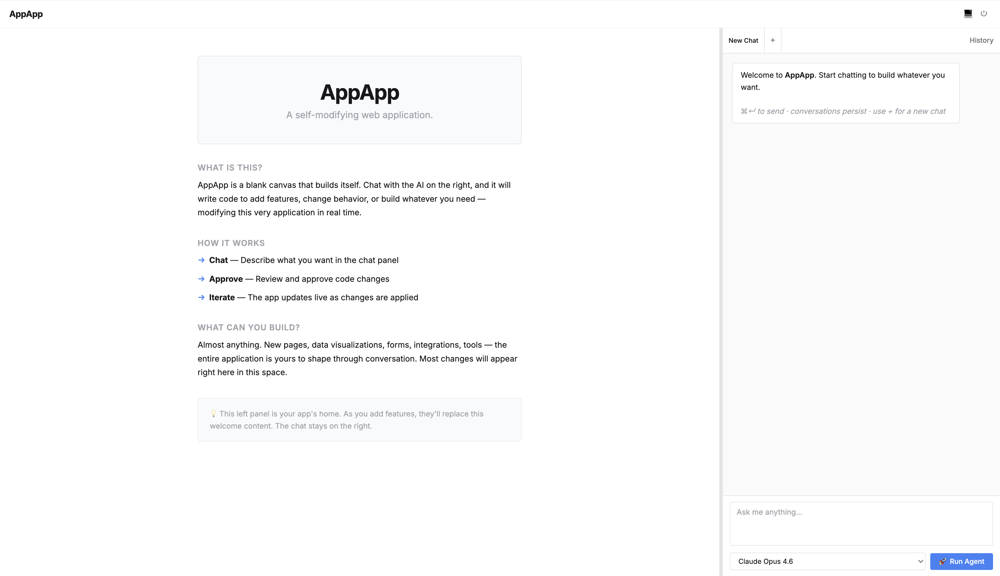

# AppApp: The App App




**The app that builds apps.** Chat with an AI in your browser, and watch it write code to build whatever you ask for — modifying the very application you're using, in real time.
git 
No IDE. No terminal. No code knowledge required. Just conversation.

## Try This

Open AppApp and type something like:

> "Build me a Kanban board with drag-and-drop columns."

Or:

> "Add a live markdown editor with preview on the left side."

Or go weird:

> "Make a pixel art drawing tool with a color palette and export button."

Every change the AI proposes shows up as an approval card. You see exactly what's being modified, click Allow, and the app rebuilds itself in front of you. Don't like it? Say so. Want it different? Just ask. The whole thing is a conversation.

**The canvas is blank. What you build is up to you.**

## How It Feels

When you first open AppApp, you'll see a simple two-panel layout: a blank canvas and a chat panel. That's just the starting point — not the destination. Ask the AI to rearrange, redesign, or completely reimagine the interface and it will. Nothing about the layout is sacred except the chat itself (that's how you keep talking to the AI).

The feedback loop is tight: describe → review → approve → see it live → iterate. Each cycle takes seconds. You can go from "nothing" to "something genuinely useful" in a single sitting, without writing a line of code yourself.

## The Backstory

This started life as a personal productivity tool called *FieldNotes* — a workspace I built for daily notes, strategic planning, and account tracking. It had a dozen domain-specific features wired to various APIs.

Over time, I realized the interesting part wasn't any of the features. It was the loop: **an app that could reshape itself through conversation.** The features were just proof that the loop worked.

So I tore out everything specific and stripped it down to a clean, general-purpose shell. What's left is the engine — a chat-driven interface backed by Claude Code that can build just about anything from a blank canvas. The constraints are your imagination and the model's capabilities, and both of those are expanding fast.

## Prerequisites

- **[Claude Code](https://docs.anthropic.com/en/docs/claude-code)** — the AI backend. Install it and log in first.
- **Python 3.11+**

That's it. The install script handles everything else.

## Install

**One command:**

```bash
curl -fsSL https://raw.githubusercontent.com/DavidMorton/app-app/main/install.sh | bash
```

This will:
1. Install [uv](https://docs.astral.sh/uv/) (a fast Python package manager) if you don't have it
2. Download AppApp to `~/AppApp`
3. Install dependencies
4. Set up the `appapp` command

**Then start it:**

```bash
appapp
```

Open [http://127.0.0.1:5050](http://127.0.0.1:5050) and start building.

<details>
<summary><strong>Manual install (if you prefer)</strong></summary>

```bash
git clone https://github.com/DavidMorton/app-app.git
cd AppApp
uv sync
cd src/web_app
uv run python app.py
```

Or with pip:

```bash
git clone https://github.com/DavidMorton/app-app.git
cd AppApp
pip install -r src/web_app/requirements.txt
cd src/web_app
python app.py
```

</details>

## How It Works

1. **You type a message** in the chat panel
2. **Claude Code runs** as a subprocess, generating tool calls based on your request
3. **Every tool call hits an MCP approval gate** — a lightweight server that intercepts file writes, edits, and shell commands
4. **Approval cards appear in the chat** — you see the exact change and decide Allow or Deny
5. **On approval, the code changes execute**, the app auto-restarts, and the browser reloads
6. **You see the new version instantly** and keep iterating

### Architecture

```
Browser (vanilla JS)
  ├── Chat panel ←→ Flask API (SSE streaming)
  │                    └── Claude Code CLI subprocess
  │                          └── MCP approval-gate server
  │                                └── Flask approval endpoints
  └── Your app — starts as a blank canvas, becomes whatever you want
```

- **Flask backend** — serves the UI, manages sessions, streams agent output via Server-Sent Events
- **Claude Code CLI** — the AI engine, spawned per-chat with `--input-format stream-json`
- **MCP approval gate** — JSON-RPC server wrapping Write, Edit, MultiEdit, and Bash with user consent
- **File monitor** — detects source changes and auto-restarts (with deferred restart logic so concurrent chat sessions aren't interrupted)

### Design Decisions

- **No frontend frameworks.** Vanilla HTML/CSS/JS. The AI can read and modify the entire frontend without navigating a build system, component tree, or transpilation step. This is intentional — the simpler the code, the better the AI can work with it.
- **Approval on everything.** The AI cannot touch a file or run a command without explicit user consent. This is enforced at the MCP layer, not by trusting the model. You always have the last word.
- **Multiple concurrent chats.** Each tab runs its own Claude Code process. Open several, work on different features in parallel. The backend tracks active agents and defers restarts until all sessions complete.
- **Deliberately small.** ~2,500 lines total. No database, no external services beyond the Claude API. You can read the entire codebase in an afternoon — and so can the AI.

## Project Structure

```
src/web_app/
  app.py                        # Flask entry point
  config.py                     # Configuration
  agents/
    base.py                     # AgentProvider interface
    claude_code_provider.py     # Claude Code CLI integration
  controllers/
    agent_controller.py         # /api/agent/* — run, cancel, models
    approval_controller.py      # /api/approval/* — request, wait, decide
    chat_controller.py          # /api/chats/* — persistence
    meta_controller.py          # /, health, restart
    permissions_controller.py   # /api/permissions/* — rule management
  mcp/
    approval_gate.py            # MCP JSON-RPC approval server
  services/
    agent_session_service.py    # Prompt assembly + SSE streaming
    chat_repository.py          # Chat history (JSON files on disk)
    file_monitor_service.py     # File change detection + auto-restart
    image_service.py            # Image attachment processing
    permission_rules_service.py # Allow/deny rule engine
  static/
    app.js                      # UI init, tab management, panel resizer
    chat.js                     # ChatEngine — rendering, streaming, approvals
    styles.css                  # Theme system (light/dark/system)
  templates/
    index.html                  # Single-page shell
```

## Ideas to Get You Started

The whole point is to explore. Here are some starting points, but don't limit yourself:

- **A personal dashboard** — weather, calendar, bookmarks, notes, all in one page
- **A data visualization tool** — paste CSV data and get interactive charts
- **A drawing app** — pixel art, freehand sketching, SVG editing
- **A game** — Snake, Tetris, a text adventure, a multiplayer board game
- **A writing tool** — distraction-free editor with word counts and export
- **A project tracker** — Kanban board, Gantt chart, or just a smart to-do list
- **An API explorer** — point it at any REST API and browse responses interactively
- **Something nobody's thought of yet** — that's the fun part

The AI has full access to the app's source files (with your approval). It can add pages, create JavaScript modules, pull in CDN libraries, modify styles, install Python packages, and run shell commands. If it can run in a browser, you can probably build it here.

## License

MIT
